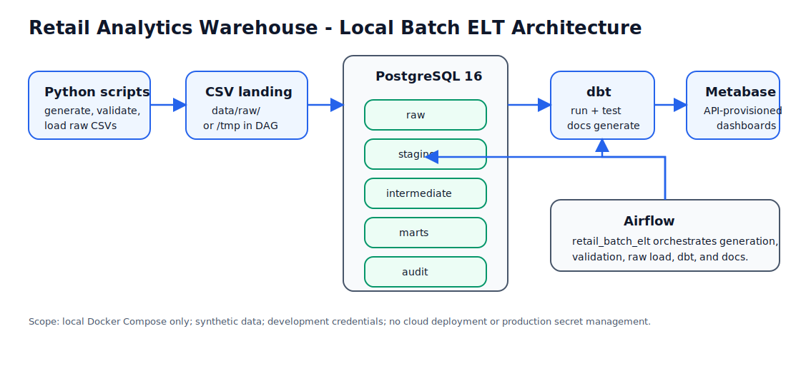

# Retail Analytics Warehouse

A portfolio-ready, local-first batch ELT warehouse that turns synthetic retail CSVs into tested PostgreSQL marts, orchestrated Airflow runs, and Metabase dashboards.

The project is intentionally scoped to a developer machine: one Docker Compose stack, deterministic generated data, dbt Core transformations, and API-provisioned BI assets. It demonstrates practical data engineering patterns without requiring cloud accounts or managed services.

## Value Proposition

For hiring managers and data engineering reviewers, this repository shows the full lifecycle of a modern analytics warehouse:

- Source generation and validation before loading.
- Audited raw ingestion into PostgreSQL.
- dbt staging, intermediate, and marts layers with tests.
- Airflow orchestration for the complete ELT flow.
- Metabase dashboard provisioning and smoke verification through code.
- Portfolio documentation that explains architecture, trade-offs, and demo steps.

End-to-end flow:

```text
Local CSV generation -> raw PostgreSQL -> dbt marts -> Airflow orchestration -> Metabase dashboards
```



## Feature Highlights

- Deterministic synthetic retail domain: customers, products, stores, promotions, orders, order items, payments, inventory, and returns.
- Raw ingestion with source validation, row-count audit tables, and deterministic truncate/reload behavior for local demos.
- dbt Core warehouse layers:
  - `staging` views for type casting and source cleanup.
  - `intermediate` views for reusable business logic.
  - `marts` dimension and fact tables for analytics consumption.
- Full Airflow DAG: generate data, validate, load raw tables, run dbt debug/run/test, and generate dbt docs.
- Metabase API provisioning for six dashboards in a `Retail Analytics` collection.
- Pytest coverage for generator, validator, Airflow DAG structure, Metabase provisioning definitions, and documentation links/assets.

## Tech Stack

| Layer | Technology |
| --- | --- |
| Local runtime | Docker Compose |
| Warehouse | PostgreSQL 16 |
| Orchestration | Apache Airflow 2.9.1 on Python 3.11 |
| Transformations | dbt Core + dbt-postgres |
| BI | Metabase |
| App/scripts | Python, pandas, Faker, psycopg2 |
| Quality | pytest, dbt tests, Metabase smoke checks |

## Repository Map

```text
.
├── airflow/                  # Airflow image and retail_batch_elt DAG
├── dbt/retail_warehouse/     # dbt project, profiles, staging/intermediate/marts models
├── docs/                     # Architecture, model, pipeline, runbook, BI, portfolio docs
├── docs/assets/              # Lightweight SVG/Markdown portfolio diagrams
├── scripts/                  # Data generation, validation, raw load, Metabase provisioning
├── tests/                    # Python and docs/link tests
├── warehouse/init/           # PostgreSQL schema/table bootstrap SQL
├── docker-compose.yml        # PostgreSQL, Airflow, Metabase stack
├── Makefile                  # Local developer commands
└── README.md                 # Project overview and quickstart
```

Documentation landing page: [docs/index.md](docs/index.md)

## Quickstart: Local Verification Path

Run from the repository root. Install Python dependencies on the host first:

```bash
python -m pip install -r requirements.txt
python -m pytest tests -q
docker compose config
```

If this shell cannot access Docker directly, wrap Docker commands with the local Docker group helper:

```bash
sg docker -c 'docker compose config'
```

Start the local stack:

```bash
make up
```

Run the full Airflow ELT path once:

```bash
make airflow-dag-test AIRFLOW_RUN_DATE=2024-01-01
```

Provision and smoke-check Metabase dashboards after marts exist:

```bash
make metabase-provision
make metabase-smoke
```

Shut down services when finished:

```bash
make down
```

For a non-Airflow path that still builds the warehouse and dashboards:

```bash
make raw-pipeline
make dbt-run
make dbt-test
make metabase-provision
make metabase-smoke
```

## Verification Checklist

Use this checklist before presenting the project:

```bash
python -m pytest tests -q
docker compose config
make up
make airflow-dag-test AIRFLOW_RUN_DATE=2024-01-01
make metabase-provision
make metabase-smoke
make down
```

Expected local UIs while services are running:

- Airflow: <http://localhost:8080> (`admin` / `admin`)
- Metabase: <http://localhost:3000> (`admin@retail-analytics.local` / `RetailLocalAdmin!2026` after provisioning)
- PostgreSQL: `localhost:5432`, database `retail_warehouse`, user `retail_user`

## Dashboard Overview

Sprint 4 provisions these Metabase dashboards into the `Retail Analytics` collection:

| Dashboard | Primary questions |
| --- | --- |
| Executive Sales Overview | Net sales, refunds, AOV, payment health, daily trend |
| Product and Category Performance | Revenue, units, gross margin, top products |
| Store and Channel Performance | Store/channel sales and average order value |
| Customer Behavior | Geography and customer lifetime net sales |
| Returns and Refunds | Return rates, refund exposure, return reasons |
| Inventory Health | Restock risk by store and product |

See [docs/bi_dashboard_catalog.md](docs/bi_dashboard_catalog.md) for metric definitions and representative SQL.

## Data Model at a Glance


The marts layer contains five dimensions (`dim_customers`, `dim_products`, `dim_stores`, `dim_promotions`, `dim_date`) and five facts (`fct_sales`, `fct_order_items`, `fct_payments`, `fct_returns`, `fct_inventory_snapshots`). Details are in [docs/data_model.md](docs/data_model.md).

## Portfolio Talking Points

Use this project to discuss:

- Why local-first Docker Compose is useful for reproducible portfolio review.
- How validation and audit tables make file ingestion observable.
- Why dbt business logic is separated across staging, intermediate, and marts layers.
- How Airflow container paths and dbt profiles differ between host and Docker-network contexts.
- How BI provisioning through an API avoids manual dashboard drift.
- What is intentionally not implemented: cloud deployment, CI/CD, SCD2 history, streaming, real customer data, and production secrets management.

## Interviewer Demo Script

1. Open the README and explain the flow: CSVs -> raw -> dbt marts -> Airflow -> Metabase.
2. Show `docker-compose.yml` and the Makefile targets to establish the local runtime.
3. Run `python -m pytest tests -q` and `docker compose config`.
4. Start services with `make up`.
5. Run `make airflow-dag-test AIRFLOW_RUN_DATE=2024-01-01` to execute the ELT DAG.
6. Run `make metabase-provision && make metabase-smoke`.
7. Open Metabase and walk through the six dashboards.
8. Show dbt models and docs explaining marts, tests, and trade-offs.
9. Shut down with `make down`.

## Completion Status

Implemented sprint scope:

- Sprint 1: local stack, schemas, synthetic source generation, validation, raw ingestion, audits, tests, foundation docs.
- Sprint 2: dbt staging/intermediate/marts models, schema tests, custom business-rule test, dbt docs generation.
- Sprint 3: Airflow orchestration for the complete local ELT path.
- Sprint 4: Metabase BI dashboard catalog, API provisioning, smoke verification.
- Sprint 5: portfolio documentation polish, case study, evaluator walkthrough, docs landing page, and lightweight architecture/model assets.

## Limitations and Honest Scope

This is a local portfolio warehouse, not a production deployment. It uses synthetic data, development credentials, local Docker volumes, and truncate/reload batch processing. It does not implement cloud infrastructure, SCD2 history, streaming ingestion, CI/CD pipelines, workload autoscaling, high availability, or production-grade secret management.
