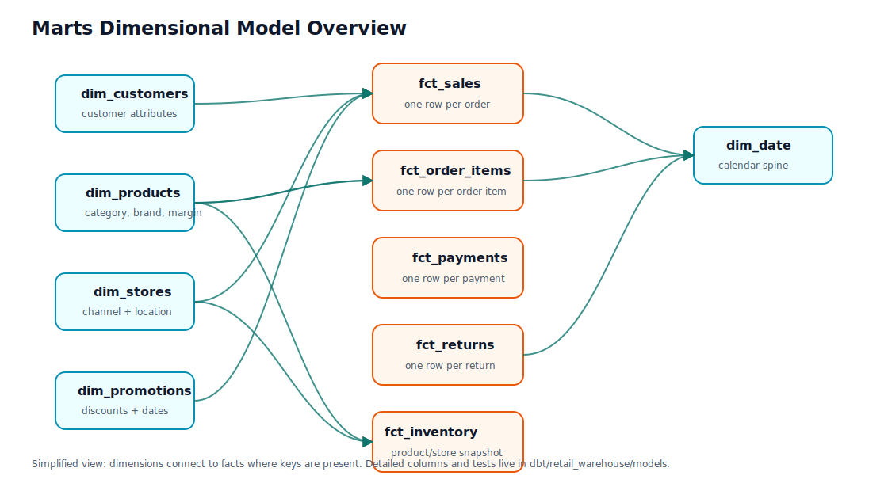

# Data Model

## Source Entities

The synthetic retail domain generates and loads these source entities:

- customers
- products
- stores
- promotions
- orders
- order_items
- payments
- inventory
- returns

## Raw Layer

The raw layer stores source-shaped data loaded from local CSV files. Raw tables intentionally avoid strict warehouse constraints so files can be loaded, audited, and inspected even when downstream quality checks fail.

## Core Relationships

- `orders.customer_id` references `customers.customer_id`.
- `orders.store_id` references `stores.store_id`.
- `orders.promotion_id` optionally references `promotions.promotion_id`.
- `order_items.order_id` references `orders.order_id`.
- `order_items.product_id` references `products.product_id`.
- `payments.order_id` references `orders.order_id`.
- `inventory.product_id` references `products.product_id`.
- `inventory.store_id` references `stores.store_id`.
- `returns.order_id` references `orders.order_id`.
- `returns.order_item_id` references `order_items.order_item_id`.
- `returns.product_id` references `products.product_id`.

## dbt Model Layers

### Staging Layer

Nine staging models, one per raw source, cast strings to correct types and normalize source values. No business logic lives in staging.

- `stg_customers`: casts `date_of_birth` to date and `created_at` to timestamp.
- `stg_products`: casts `unit_cost` and `unit_price` to numeric values and `is_active` to boolean.
- `stg_stores`: casts `opened_at` to date.
- `stg_promotions`: casts discount fields, dates, and active flags.
- `stg_orders`: casts monetary columns and `order_date`, and normalizes empty-string promotions to NULL.
- `stg_order_items`: casts quantity and monetary columns.
- `stg_payments`: casts payment amount and paid timestamp.
- `stg_inventory`: casts snapshot date and inventory counts.
- `stg_returns`: casts return timestamp and refund amount.

### Intermediate Layer

Two intermediate models implement reusable business rules:

- `int_order_items_enriched`: joins order items with product attributes and adds `revenue`, `cost`, `gross_profit`, and `gross_margin_pct`.
- `int_orders_with_payment_status`: joins orders with payments and return aggregates, adding `is_paid`, `has_return`, `return_count`, and `total_refund_amount`.

## Dimensions

Five dimension tables are materialized in the `marts` schema:

| Dimension | Grain | Notes |
| --- | --- | --- |
| `dim_customers` | one row per customer | Includes age derived from date of birth. |
| `dim_products` | one row per product | Includes category, brand, pricing, and gross margin percent. |
| `dim_stores` | one row per store | Includes channel and location fields. |
| `dim_promotions` | one row per promotion | Includes promotion type, discount value, and active date range. |
| `dim_date` | one row per day | Date spine from 2020-01-01 to 2030-12-31 with calendar attributes. |

## Facts

Five fact tables are materialized in the `marts` schema:

| Fact | Grain | Primary use |
| --- | --- | --- |
| `fct_sales` | one row per order | Executive sales, payment health, returns summary. |
| `fct_order_items` | one row per order item | Product/category revenue, cost, gross profit, margin. |
| `fct_payments` | one row per payment | Payment method/status analysis. |
| `fct_returns` | one row per return | Return reasons and refund exposure. |
| `fct_inventory_snapshots` | one row per product/store snapshot | Restock risk and inventory health. |

## Quality Tests

dbt tests validate:

- Primary-key uniqueness and non-null keys.
- Relationships between facts and dimensions.
- Accepted values for known categorical fields.
- A custom business rule that validates order totals.

These tests run through `make dbt-test` and are also part of the Airflow DAG.
