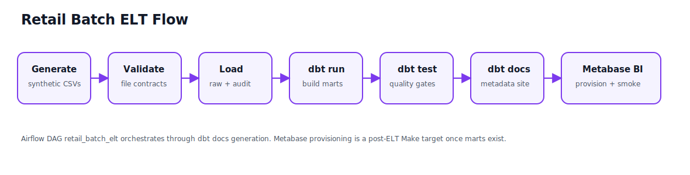

# Portfolio Case Study: Local Retail Analytics Warehouse

## Problem Statement

Retail operators need timely answers about sales, product performance, customer behavior, returns, and inventory health. In many organizations these questions depend on disconnected source files, fragile manual loads, and dashboards that are hard to reproduce.

This project builds a local, reproducible analytics warehouse that starts with generated retail CSVs and ends with tested marts plus provisioned Metabase dashboards.

## Goals

- Demonstrate a complete modern batch ELT workflow on a laptop.
- Keep every service local and reproducible through Docker Compose.
- Separate ingestion, transformation, orchestration, and BI concerns.
- Make data quality visible through validation scripts, audit tables, dbt tests, warehouse quality checks, and smoke checks.
- Provide a portfolio package that reviewers can inspect without private credentials or cloud accounts.

## Architecture Decisions

| Decision | Rationale |
| --- | --- |
| PostgreSQL-only warehouse | Simple local operation and transparent SQL inspection. |
| Local CSV landing zone | Avoids cloud dependencies while preserving a realistic file-ingestion boundary. |
| Raw tables are source-shaped | Keeps ingestion auditable and pushes business logic downstream. |
| dbt staging/intermediate/marts layers | Encodes transformation semantics and testable warehouse contracts. |
| Airflow LocalExecutor in Docker Compose | Demonstrates orchestration without managed infrastructure. |
| Metabase API provisioning | Makes BI setup repeatable and reviewable in code. |
| Explicit local hardening assets | Adds quality observability, idempotent indexes, and SCD2 readiness without adding cloud/Spark/Kafka/Kubernetes scope. |
| SVG/Markdown assets | Keeps portfolio diagrams lightweight and renderable on GitHub. |



## Data Model

The source domain contains customers, products, stores, promotions, orders, order items, payments, inventory snapshots, and returns. dbt transforms these into:

- Dimensions: `dim_customers`, `dim_products`, `dim_stores`, `dim_promotions`, `dim_date`.
- Facts: `fct_sales`, `fct_order_items`, `fct_payments`, `fct_returns`, `fct_inventory_snapshots`.

The marts support executive sales, margin analysis, store/channel performance, customer lifetime value, returns/refunds, and inventory restock questions.

## Orchestration

The `retail_batch_elt` Airflow DAG executes:

```text
start -> generate_retail_data -> validate_source_files -> load_raw_to_postgres -> dbt_debug -> dbt_run -> dbt_test -> dbt_docs_generate -> end
```

The DAG uses container-local writable paths for generated CSVs and dbt artifacts to avoid host/container ownership conflicts in the bind-mounted repository.

## Quality Strategy

Quality gates are layered:

1. Python source validation catches missing files, missing columns, invalid IDs, broken relationships, and numeric issues before loading.
2. Raw load audit tables record batch and file-level row counts.
3. dbt schema tests validate uniqueness, not-null constraints, accepted values, and relationships.
4. A custom dbt business-rule test checks order totals.
5. The Sprint 6 warehouse quality script checks post-ELT row counts, revenue sanity, order/item reconciliation, returns/refunds, key uniqueness/nulls, audit state, and inventory sanity.
6. Metabase smoke checks verify BI objects and representative marts queries through the Metabase API.
7. Pytest verifies core scripts, DAG structure, provisioning definitions, warehouse quality evaluation logic, and documentation links/assets.

## BI Outcomes

The BI layer provisions six dashboards:

- Executive Sales Overview.
- Product and Category Performance.
- Store and Channel Performance.
- Customer Behavior.
- Returns and Refunds.
- Inventory Health.

These dashboards answer operational questions around revenue, refunds, margin, store performance, customer value, and restock risk.

## Trade-offs

- Truncate/reload ingestion favors deterministic demos over full incremental history, though a customer dbt snapshot example documents SCD2 readiness.
- Synthetic data makes the repository safe to publish but does not capture all real-world retail irregularities.
- PostgreSQL is sufficient for local analytics but is not a cloud-scale warehouse substitute.
- Metabase dashboard layout is intentionally simple and API-driven rather than hand-polished in the UI.
- Local development credentials are documented for reproducibility and must not be reused for production.

## Limitations

This project does not implement production deployment, cloud storage, managed Airflow, production CI/CD, streaming ingestion, autoscaling, high availability, or production secret management. Incremental dbt models, broader SCD2 coverage, Great Expectations, lineage, and cloud migration are documented in [hardening_roadmap.md](hardening_roadmap.md) rather than claimed as production-ready features.

## Extension Roadmap

Potential future increments:

1. Add production CI that runs pytest, dbt parse, documentation link checks, and Docker Compose validation.
2. Expand incremental dbt models and SCD2 snapshots beyond the implemented customer snapshot example.
3. Add Great Expectations or dbt-expectations for richer data contracts.
4. Add a cloud variant using object storage, managed orchestration, and a warehouse service.
5. Add seeded anomaly scenarios to stress-test quality gates and dashboard alerts.
6. Add generated dashboard screenshots after a deterministic demo run.

## Result

The completed Sprint 6 package is a coherent portfolio artifact: code, orchestration, BI, tests, hardening checks, runbook, diagrams, walkthrough, and honest limitations are all visible from the README and docs index.
